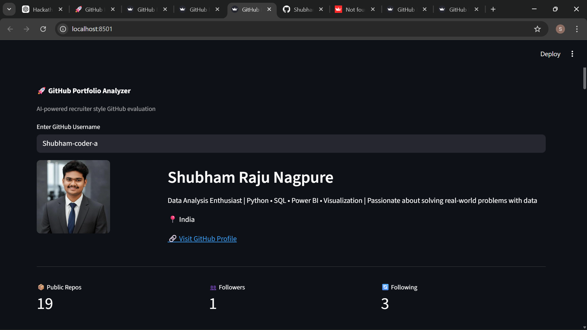
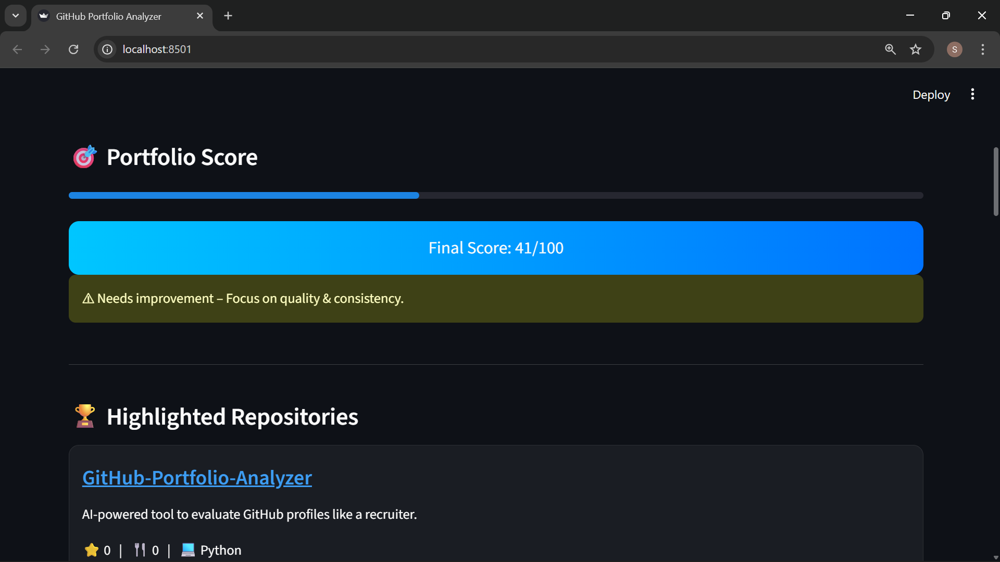
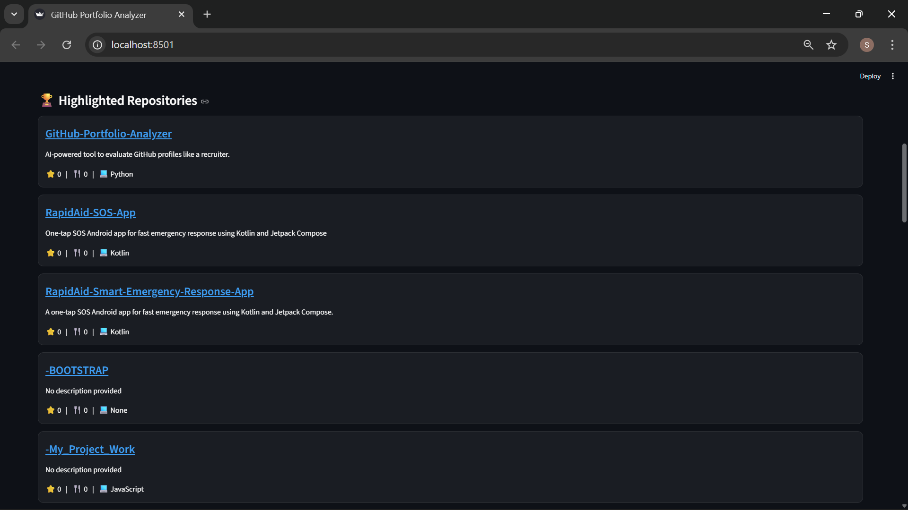
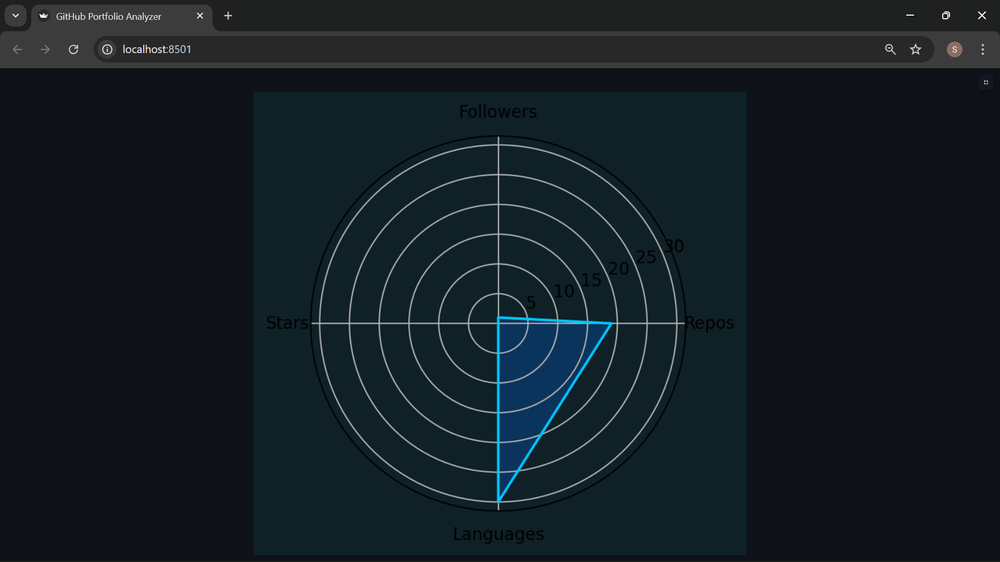

# 🚀 GitHub Portfolio Analyzer

🚀 AI-powered GitHub Portfolio Evaluation Tool  
Built with Python, Streamlit & GitHub REST API


---

# 📌 Overview

GitHub Portfolio Analyzer is a Streamlit-based web application that analyzes public GitHub profiles and provides a structured evaluation of a developer’s portfolio strength.

It generates a recruiter-style analysis including:

- 📊 Portfolio Score (0–100)
- 🧠 Recruiter Verdict
- 🏆 Pinned Repository Highlights
- 📈 Language Distribution Chart
- 🎯 Developer Strength Radar
- 📡 Public Repo & Activity Metrics

---

# 🎯 Problem Statement

Recruiters often evaluate candidates based on their GitHub presence.  
However, most developers don’t know:

- How strong their profile looks
- Whether their projects show impact
- If their pinned repositories are effective
- What needs improvement

This tool solves that problem by giving a clear, structured portfolio evaluation.

---

# ⚙️ Features

✔ Analyze any public GitHub username  
✔ Fetch real-time GitHub API data  
✔ Display pinned repositories  
✔ Clickable repository links  
✔ Generate portfolio score  
✔ Recruiter-style feedback system  
✔ Language distribution visualization  
✔ Developer strength radar chart  
✔ Modern glassmorphism UI styling  

---

# 🧠 Portfolio Scoring Logic

The portfolio score is calculated based on:
- 📁 Number of Public Repositories
- ⭐ Total Stars
- 👥 Followers
- 🔄 Recent Activity
- 💻 Technology Diversity

## Score Interpretation
- **75+** → 🔥 Strong GitHub Presence (Recruiter Ready)
- **50–74** → 👍 Good Profile (Improve Impact Projects)
- **Below 50** → ⚠ Needs Improvement (Focus on Quality & Consistency)

---

# 🛠 Tech Stack
- Python
- Streamlit
- GitHub REST API
- Requests
- Matplotlib
- HTML + CSS (Custom UI Styling)

---

# 📊 Visualizations

- 📈 Language Distribution Chart
- 🎯 Developer Strength Radar Chart
- 📌 Highlighted / Pinned Repository Cards

---

# 🚀 Installation & Setup

Clone the repository:
```bash
git clone https://github.com/Shubham-coder-a/GitHub-Portfolio-Analyzer.git
cd GitHub-Portfolio-Analyzer

---
# 📸 Demo Preview

## 🧑 Profile Overview


## 🎯 Portfolio Score & Verdict


## 🏆 Highlighted Repositories


## 📊 Language Distribution
.png)

## 📈 Developer Strength Radar


---
# 🎯 Future Enhancements

GitHub contribution heatmap analysis
AI-based project quality scoring
Resume improvement suggestions
Portfolio improvement recommendations
Export analysis as PDF

---
👨‍💻 Author

Shubham Raju Nagpure
B.Sc IT | Data Analytics Enthusiast
Python • SQL • Power BI • Visualization

---
⭐ Support

If you found this project useful, please consider giving it a ⭐ on GitHub.


---
# 🏁 Hackathon Submission
**Project Name:** GitHub Portfolio Analyzer  
**Category:** Developer Tools / AI-Based Evaluation  
**Built Using:** Python, Streamlit, GitHub REST API  
**Objective:** To evaluate GitHub profiles from a recruiter’s perspective and provide structured improvement insights.
